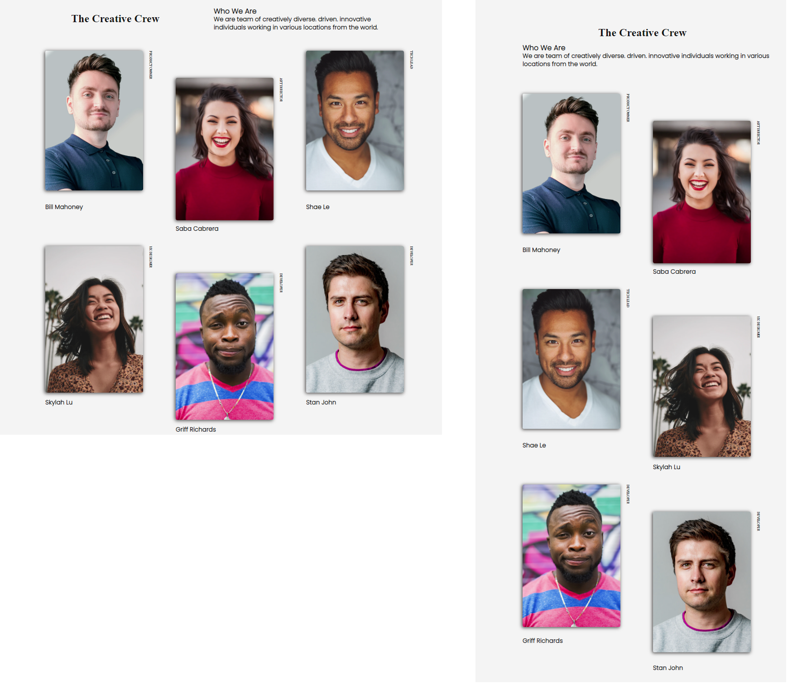

# Project: Team Members Page (HC-004)

👨‍💻 The main aim of this project is to improve my <b>HTML/CSS skills and ©️cloning abilities</b>.

🔗 To see live version 🎯https://tal58.github.io/Team_Members_Page/
<br>

## Project Skeleton 

```
004-team-members-page(folder)
|
|----readme.md         # Given to the students (Definition of the project)
|----/images # Contains development team members photos         
|----solution
        |----index.html  
        |----style.css   
        
```

## Expected Outcome



## Objective

🎯 Your challenge is to build out this page and get it looking as close to the design as possible..
[Project 004 Snapshot](./project04.png) 


<center> ⌛ Happy Coding  ✍ </center>

